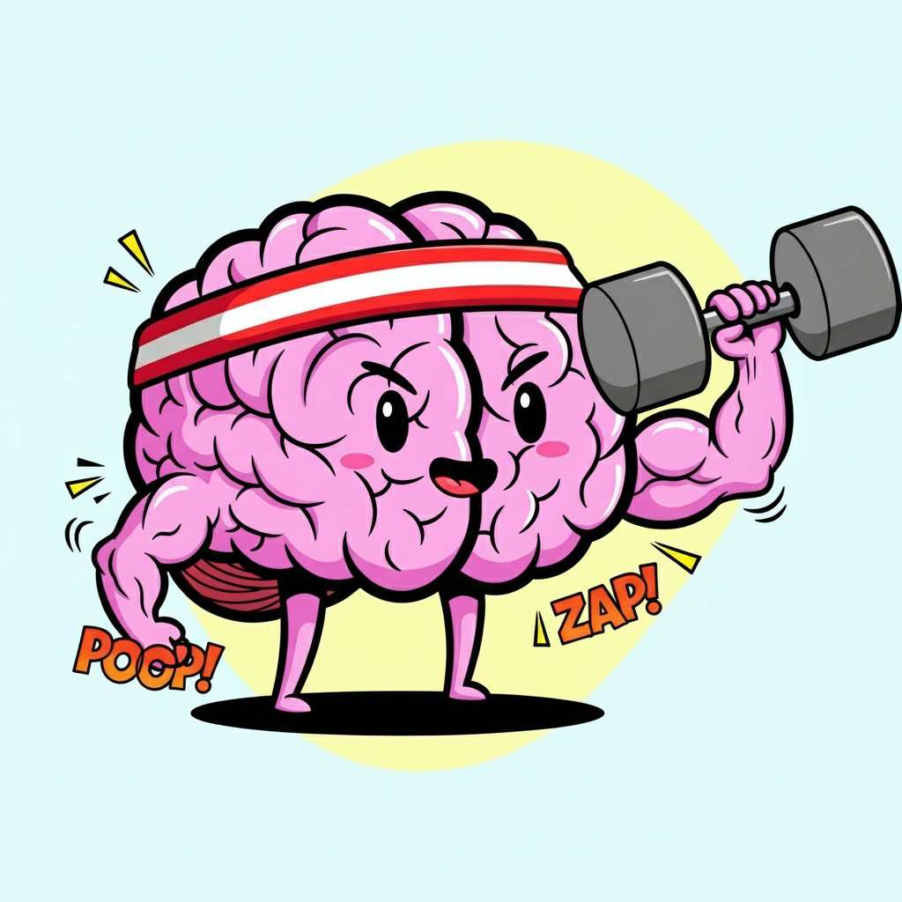

# skills

Skills for AI agents.

Made with ✨sparkles✨ by [maragu](https://www.maragu.dev/): independent software consulting for cloud-native Go apps & AI engineering.

[Contact me at markus@maragu.dk](mailto:markus@maragu.dk) for consulting work, or perhaps an invoice to support this project?

## Available Skills

- **brainstorm** - Guide for brainstorming ideas and turning them into fully formed designs through iterative questioning
- **code-review** - Guide for making code reviews using competing agents to find architecture and implementation issues
- **decisions** - Guide for recording significant architectural and design decisions in `docs/decisions.md`
- **git** - Guide for using git according to preferences (branch naming, commit messages, issue references)
- **go** - Guide for developing Go apps and modules/libraries (code style, testing, dependency injection, package structure)
- **gomponents** - Guide for working with gomponents, a pure Go HTML component library for building HTML views
- **journal** - Guide for using the AI's persistent journal database to capture insights and lessons learned
- **nanobanana** - Guide for generating and editing images using generative AI with the nanobanana CLI
- **skill-creator** - Guide for creating effective skills that extend AI capabilities with specialized knowledge and workflows
- **worktrees** - Guide for using git worktrees to parallelize development with coding agents in isolated environments
